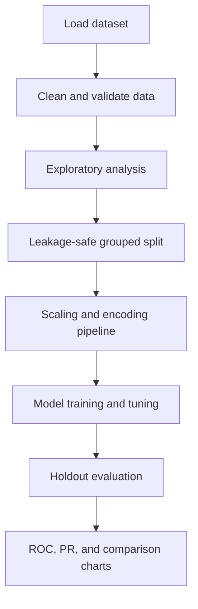
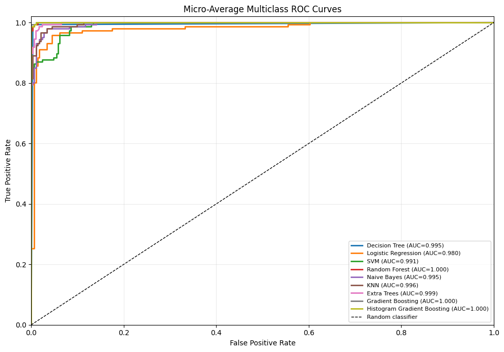
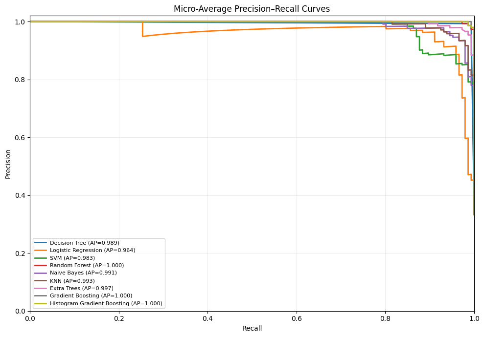

<div align="center">

# Diabetes Prediction Using Machine Learning

### A multiclass machine-learning study for identifying non-diabetic, prediabetic, and diabetic patient profiles


[Project Overview](#project-overview) •
[Models](#machine-learning-models) •
[Evaluation](#model-evaluation) •
[Run Locally](#getting-started) •
[Visualizations](#visualizations)

</div>

---

## Project Overview

This project develops and compares multiple machine-learning models for multiclass diabetes prediction using demographic information and clinical measurements.

The prediction target contains three classes:

| Label | Meaning |
|:---:|---|
| `N` | Non-diabetic |
| `P` | Prediabetic |
| `Y` | Diabetic |

The notebook covers the complete workflow: data inspection, cleaning, exploratory analysis, outlier detection, preprocessing, model training, hyperparameter tuning, evaluation, and visualization.

> **Important:** This project is intended for educational and research purposes only. It is not a medical diagnostic system and should not replace professional medical advice.

## Project Highlights

- Analyzes **1,000 patient records** with demographic and laboratory measurements.
- Cleans inconsistent class and gender labels.
- Checks missing values, distributions, correlations, outliers, and class imbalance.
- Prevents identical feature profiles from appearing in both training and testing data.
- Uses preprocessing pipelines to avoid data leakage during training and cross-validation.
- Compares **nine classification models** using imbalance-aware metrics.
- Includes multiclass ROC and precision–recall curves.
- Uses group-aware cross-validation for more trustworthy model evaluation.

## Dataset

The dataset contains 14 columns, including two identifier fields, 11 predictive features, and one target column.

| Feature | Description |
|---|---|
| `Gender` | Patient gender |
| `AGE` | Patient age |
| `Urea` | Blood urea measurement |
| `Cr` | Creatinine level |
| `HbA1c` | Average blood glucose indicator |
| `Chol` | Total cholesterol |
| `TG` | Triglycerides |
| `HDL` | High-density lipoprotein cholesterol |
| `LDL` | Low-density lipoprotein cholesterol |
| `VLDL` | Very-low-density lipoprotein cholesterol |
| `BMI` | Body mass index |
| `CLASS` | Diabetes classification target |

`ID` and `No_Pation` are treated as identifiers and are not used as predictive medical features.

### Class Distribution

The dataset is imbalanced, with substantially more diabetic records than prediabetic and non-diabetic records. For this reason, model selection does not rely on accuracy alone.

<p align="center">
  
</p>

## Machine-Learning Workflow



### Preprocessing

- Whitespace and capitalization are standardized in categorical values.
- Identifier columns are excluded from model training.
- Numerical features are standardized inside each model pipeline.
- Gender is one-hot encoded with unknown-category handling.
- Identical patient feature profiles are grouped during splitting to prevent train–test overlap.
- Hyperparameter searches use stratified, group-aware cross-validation.

## Exploratory Data Analysis

The notebook includes:

- Summary statistics for numerical and categorical variables.
- Feature distributions and skewness.
- Boxplots and IQR-based outlier counts.
- DBSCAN-based multivariate outlier detection.
- Correlation heatmap.
- Class-level boxplots and violin plots.
- Pair plots and regression plots for selected clinical measurements.

<p align="center">
  
</p>

## Machine-Learning Models

| Model | Category | Main Purpose |
|---|---|---|
| Decision Tree | Tree-based | Interpretable decision rules and feature importance |
| Logistic Regression | Linear | Explainable multiclass baseline |
| Support Vector Machine | Kernel-based | Nonlinear decision boundaries |
| Random Forest | Bagging ensemble | Stable nonlinear classification |
| Gaussian Naive Bayes | Probabilistic | Fast probability-based baseline |
| K-Nearest Neighbors | Instance-based | Similarity-based classification |
| Extra Trees | Randomized ensemble | Strong variance reduction and nonlinear learning |
| Gradient Boosting | Boosting ensemble | Sequential correction of prediction errors |
| Histogram Gradient Boosting | Boosting ensemble | Efficient class-balanced nonlinear learning |

## Model Evaluation

Because the target classes are imbalanced, the notebook reports several complementary metrics:

- **Accuracy:** Overall percentage of correct predictions.
- **Balanced accuracy:** Average recall across all classes.
- **Macro F1:** Gives equal importance to every class.
- **Macro ROC-AUC:** Measures one-vs-rest ranking performance across classes.
- **Macro average precision:** Summarizes precision–recall performance across classes.
- **Confusion matrix:** Shows exactly which classes are confused.

<p align="center">
  
</p>

### Why Macro F1 Matters

The prediabetic class is much smaller than the diabetic class. A model could achieve high accuracy while still performing poorly on prediabetic patients, whereas macro F1 gives every class equal weight.

## Visualizations

### Multiclass ROC Curves

ROC curves are calculated using a one-vs-rest strategy for the three target classes.

<p align="center">
  
</p>

### Precision–Recall Curves

Precision–recall curves are especially useful for evaluating performance on the smaller classes.

<p align="center">
  
</p>

## Repository Structure

```text
Diabetes-Prediction/
├── Diabetes.csv
├── diabetes_prediction_extended.ipynb
├── figures/
│   ├── class_distribution.png
│   ├── correlation_heatmap.png
│   ├── model_performance_comparison.png
│   ├── multiclass_roc_curves.png
│   └── precision_recall_curves.png
└── README.md
```

## Getting Started

### 1. Clone the repository

```bash
git clone https://github.com/Omartariq22/Diabetes-Prediction.git
cd Diabetes-Prediction
```

### 2. Create a virtual environment

#### Windows

```powershell
python -m venv .venv
.venv\Scripts\activate
```

#### macOS or Linux

```bash
python3 -m venv .venv
source .venv/bin/activate
```

### 3. Install the required packages

```bash
pip install pandas numpy matplotlib seaborn scikit-learn jupyter
```

### 4. Run the notebook

```bash
jupyter notebook diabetes_prediction_extended.ipynb
```

You can also open the repository in VS Code, select the `.venv` Python kernel, and run the notebook from top to bottom.

> Keep `Diabetes.csv` in the same folder as the notebook so the dataset loads correctly.

## Adding the Images to GitHub

1. Create a folder named `figures` in the project root.
2. Export the corresponding notebook graphs using the filenames shown below.
3. Commit and push the `figures` folder with the README.

```python
plt.savefig(
    "figures/model_performance_comparison.png",
    dpi=300,
    bbox_inches="tight",
)
plt.show()
```

Use these exact filenames so the images appear automatically in the README:

```text
class_distribution.png
correlation_heatmap.png
model_performance_comparison.png
multiclass_roc_curves.png
precision_recall_curves.png
```

## Limitations

- The dataset is relatively small and strongly imbalanced.
- Some records contain identical clinical feature profiles.
- Results are based on one dataset and should be validated on external patient populations.
- Outlier detection identifies unusual observations but does not determine whether they are measurement errors.
- High predictive performance does not establish clinical validity or causality.

## Future Improvements

- Add external validation using a separate clinical dataset.
- Calibrate predicted probabilities.
- Add SHAP-based local and global explanations.
- Investigate threshold tuning for the prediabetic class.
- Add automated tests and a reproducible `requirements.txt` file.
- Deploy the selected model through a Streamlit or FastAPI interface.

---

<div align="center">

If you found this project useful, consider giving the repository a ⭐

</div>
