# 🩺 Diabetes Prediction Using Machine Learning


---

## 📖 Project Overview

This project presents an **end-to-end Machine Learning pipeline** for predicting diabetes using patient medical records.

The project demonstrates the complete machine learning workflow, including:

- Data Cleaning
- Exploratory Data Analysis (EDA)
- Feature Engineering
- Data Preprocessing
- Outlier Detection
- Hyperparameter Optimization
- Cross Validation
- Model Evaluation
- Model Comparison

Six different machine learning algorithms were implemented and compared to determine the best-performing classifier for diabetes prediction.

---

# 🎯 Objectives

- Predict whether a patient is:
  - Normal
  - Prediabetic
  - Diabetic

- Compare multiple machine learning algorithms.

- Analyze the influence of medical features on diabetes prediction.

- Optimize model performance using GridSearchCV.

---

# 📂 Dataset

The dataset contains **1000 patient records** collected from medical examinations.

### Features

| Feature | Description |
|----------|-------------|
| Gender | Patient Gender |
| AGE | Age |
| Urea | Blood Urea |
| Cr | Creatinine |
| HbA1c | Average Blood Sugar |
| Chol | Cholesterol |
| TG | Triglycerides |
| HDL | Good Cholesterol |
| LDL | Bad Cholesterol |
| VLDL | Very Low Density Lipoprotein |
| BMI | Body Mass Index |
| CLASS | Target Variable |

Target Classes

- N → Normal
- P → Prediabetes
- Y → Diabetes

---

# 📂 Dataset

The dataset contains **1000 patient records** collected from medical examinations.

### Target Classes

- **N** → Normal
- **P** → Prediabetic
- **Y** → Diabetic

---

## 📋 Dataset Feature Definitions

The dataset contains demographic information together with clinical and laboratory measurements commonly used to assess diabetes and related metabolic conditions.

| Feature | Type | Description | Importance |
|---------|------|-------------|------------|
| **Gender** | Categorical | Patient's biological sex | Influences metabolism and diabetes risk |
| **AGE** | Numerical | Patient age (years) | Diabetes risk generally increases with age |
| **Urea** | Numerical | Blood urea concentration | Reflects kidney function |
| **Cr** | Numerical | Blood creatinine level | Important indicator of kidney health |
| **HbA1c** | Numerical | Average blood glucose over the previous 2–3 months | Primary clinical indicator for diabetes diagnosis |
| **Chol** | Numerical | Total cholesterol level | Associated with cardiovascular complications |
| **TG** | Numerical | Triglyceride concentration | Elevated values are linked to metabolic syndrome |
| **HDL** | Numerical | High-density lipoprotein ("good" cholesterol) | Lower levels increase cardiovascular risk |
| **LDL** | Numerical | Low-density lipoprotein ("bad" cholesterol) | Higher levels contribute to heart disease risk |
| **VLDL** | Numerical | Very-low-density lipoprotein | Associated with lipid metabolism disorders |
| **BMI** | Numerical | Body Mass Index (kg/m²) | Strong indicator of obesity and diabetes risk |
| **CLASS** | Target | Diabetes classification (N, P, Y) | Variable predicted by the machine learning models |

> **Note**
>
> - The **ID** and **No_Pation** columns were excluded before model training because they are unique identifiers and do not contribute to prediction.
> - All predictive models were trained using the remaining medical and demographic features.

---

### 📊 Dataset Summary

| Property | Value |
|----------|------:|
| Number of Samples | **1000** |
| Predictive Features | **11** |
| Target Classes | **3** |
| Numerical Features | **10** |
| Categorical Features | **1** |
| Missing Values | **0** |
| Duplicate Records | **0** |

---

## 🏗️ Project Workflow

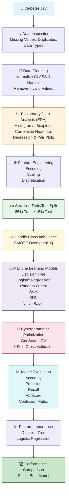
# 🔍 Exploratory Data Analysis

Several visualization techniques were used to better understand the dataset.

✔ Histograms

✔ Boxplots

✔ Violin Plots

✔ Correlation Heatmaps

✔ Pairplots

✔ Regression Plots

✔ Class Distribution

---

## 📷 Dataset Overview

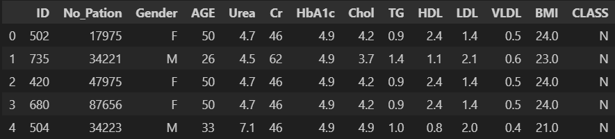

---

## 📷 Class Distribution

<p align="center">
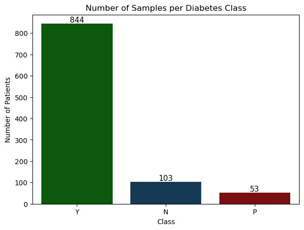
</p>

---

## 📷 Correlation Heatmap

<p align="center">
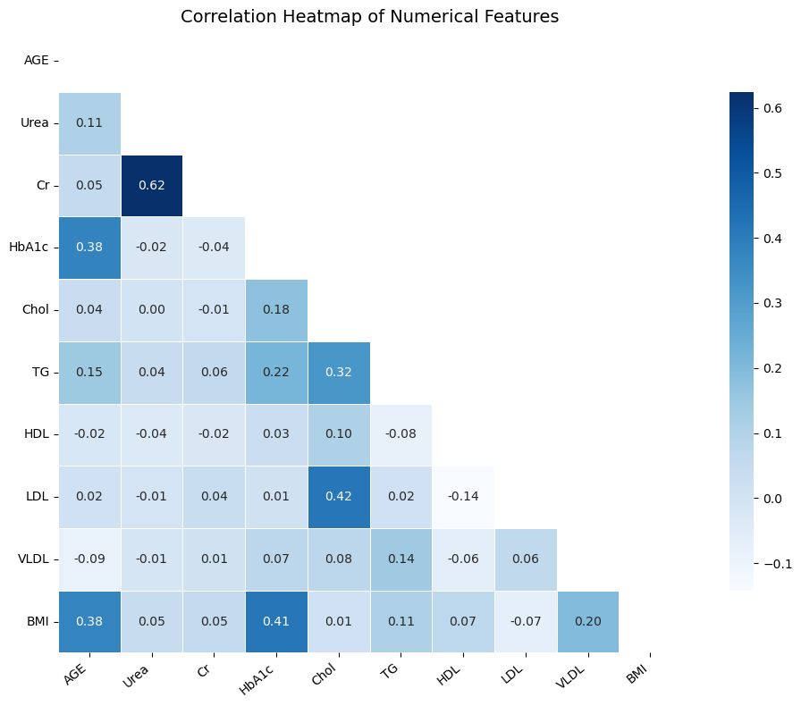
</p>

---

## 📷 Feature Relationships

The following regression plots illustrate relationships between key medical features associated with diabetes.

<p align="center">
  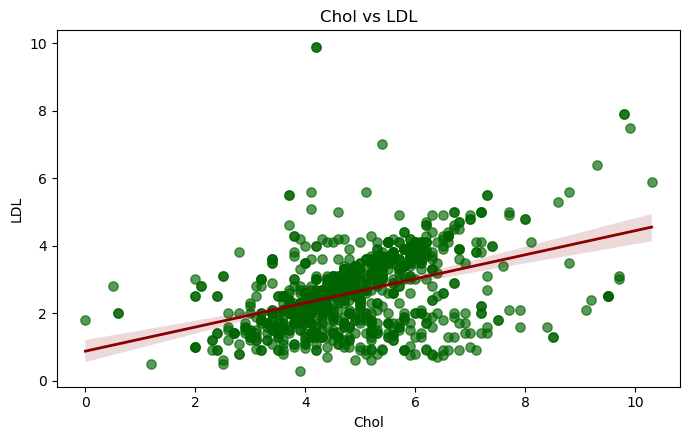
  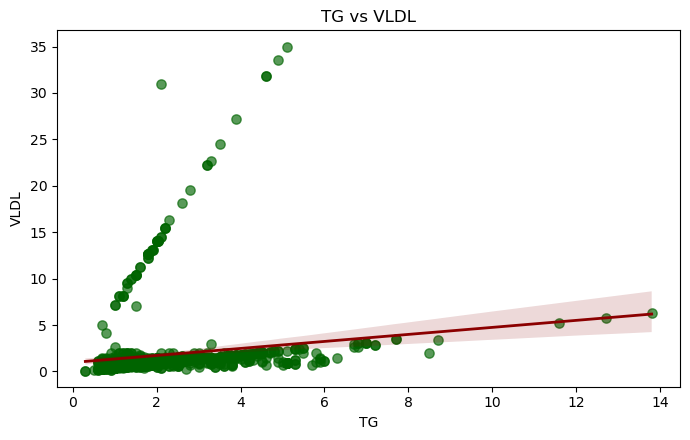
</p>

<p align="center">
  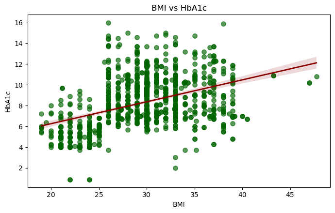
  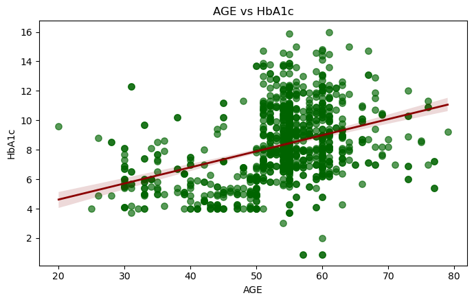
</p>

<p align="center">
  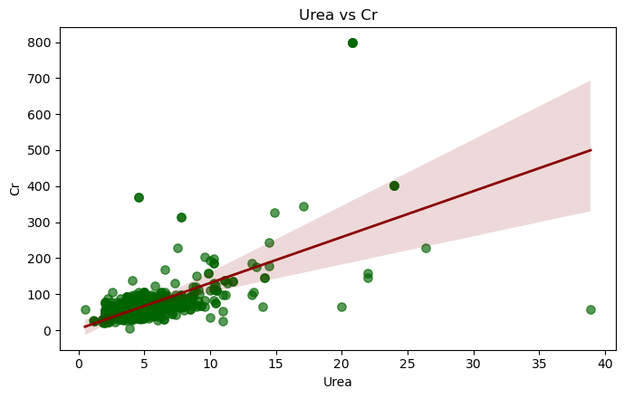
</p>

---

## 📷 Boxplots & Violin Plots

<p align="center">
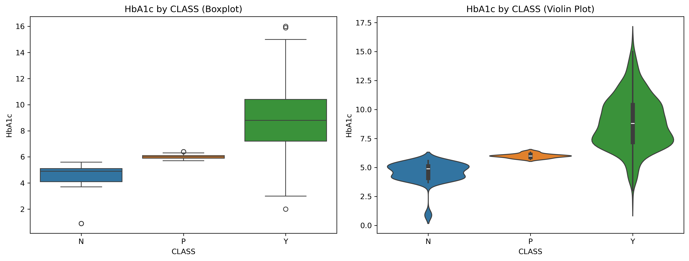
</p>

---

# ⚙ Data Preprocessing

The following preprocessing techniques were applied:

- Missing Value Checking
- Duplicate Detection
- Label Encoding
- One-Hot Encoding
- Standard Scaling
- Min-Max Scaling
- KBins Discretization
- SMOTE Oversampling
- Stratified Train/Test Split

---

# 🤖 Machine Learning Models

The following algorithms were implemented.

| Model | Hyperparameter Tuning |
|--------|----------------------|
| Decision Tree | ✅ |
| Logistic Regression | ✅ |
| Random Forest | ✅ |
| Support Vector Machine | ✅ |
| K-Nearest Neighbors | ✅ |
| Gaussian Naive Bayes | Cross Validation |

---

# 🔧 Hyperparameter Optimization

GridSearchCV was used for model optimization.

Example:

```
5-fold Cross Validation

↓

72 Parameter Combinations

↓

360 Model Fits

↓

Best Model Selected
```

---

# 📈 Model Evaluation Metrics

Each model was evaluated using

- Accuracy

- Precision

- Recall

- F1 Score

- Confusion Matrix

- Cross Validation

---

# 📷 Confusion Matrix Example

<p align="center">
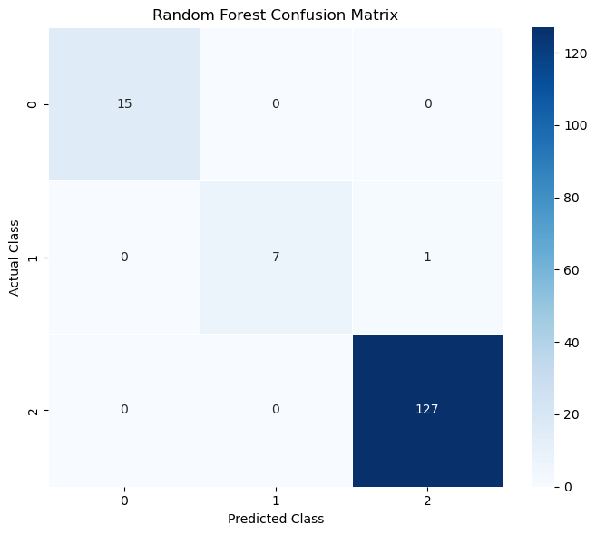
</p>

---

# 📊 Feature Importance

Decision Tree and Logistic Regression were used to analyze feature importance.

<p align="center">
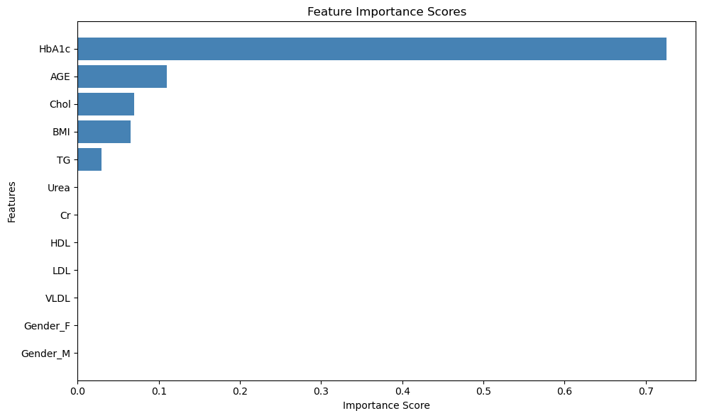
</p>

---

# 📋 Technologies Used

- Python
- Pandas
- NumPy
- Matplotlib
- Seaborn
- Scikit-Learn
- Imbalanced-Learn
- Jupyter Notebook

---

# 📦 Installation

Clone the repository

```bash
git clone https://github.com/Marwanelsaba/Diabetes-Prediction-ML.git
```

Move into the project

```bash
cd Diabetes-Prediction-ML
```

Install dependencies

```bash
pip install -r requirements.txt
```

Run the notebook

```bash
jupyter notebook diabetes_prediction.ipynb
```

---

# 📁 Project Structure

```
Diabetes-Prediction-ML
│
├── figures/
│
├── data/
│   └── Diabetes.csv
│
├── diabetes_prediction.ipynb
│
├── README.md
│
└── requirements.txt
```

---

# 🚀 Future Improvements

- Deep Learning Models
- XGBoost
- LightGBM
- CatBoost
- SHAP Explainability
- Streamlit Deployment
- Flask REST API
- Feature Selection
- Automated ML Pipeline

---

# 📌 Results

After comparing six machine learning algorithms, the optimized models demonstrated strong predictive performance for diabetes classification.

Hyperparameter tuning and cross-validation significantly improved the overall performance and robustness of the classifiers.

---
