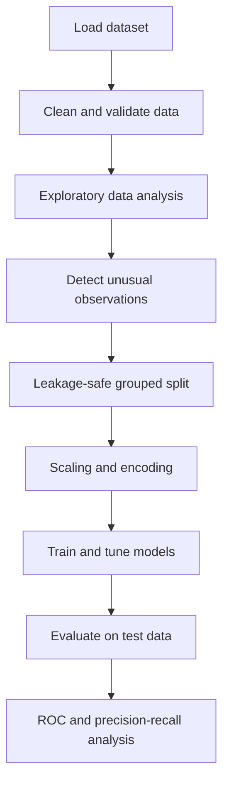
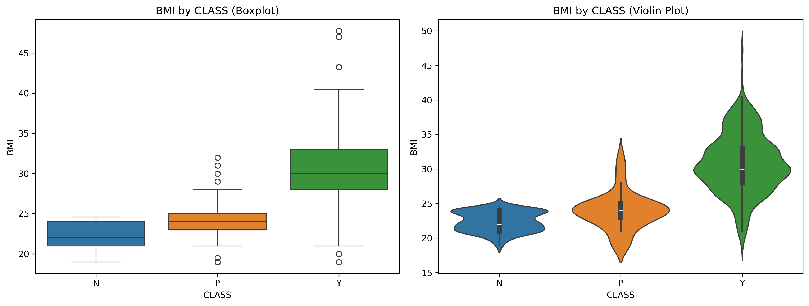
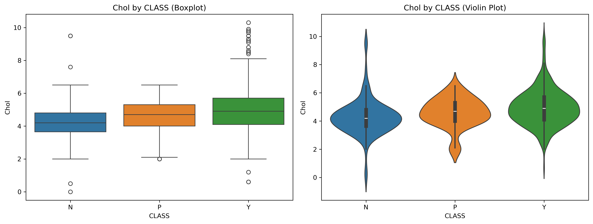
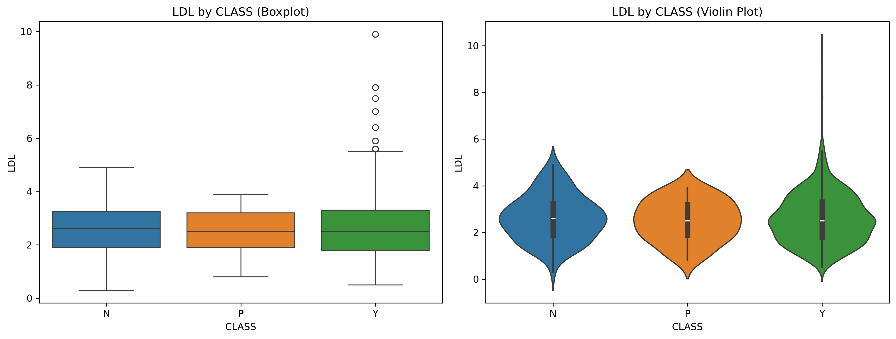
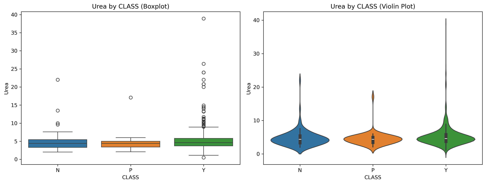
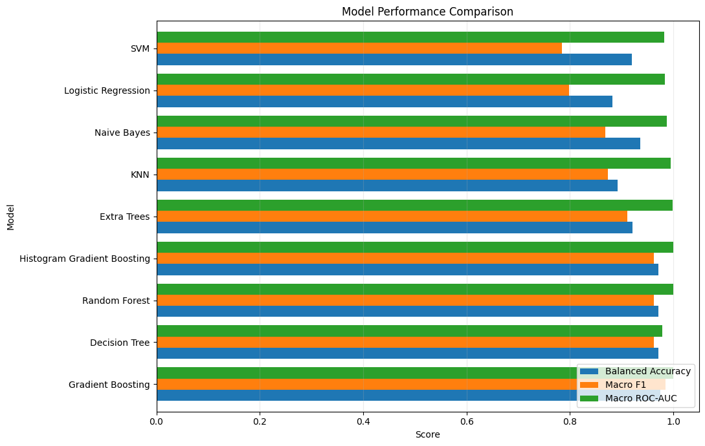

<div align="center">

# Diabetes Prediction Using Machine Learning

### Multiclass prediction of non-diabetic, prediabetic, and diabetic patient profiles


[Overview](#project-overview) •
[Dataset](#dataset) •
[Models](#machine-learning-models) •
[Evaluation](#model-evaluation) •
[Visualizations](#visualizations) •
[Installation](#getting-started)

</div>

---

## Project Overview

This project develops and compares multiple machine-learning models for multiclass diabetes prediction using demographic information and clinical measurements.

The prediction target contains three classes:

| Label | Meaning |
|:---:|---|
| `N` | Non-diabetic |
| `P` | Prediabetic |
| `Y` | Diabetic |

The notebook covers the complete machine-learning workflow:

- Data loading and validation
- Data cleaning
- Exploratory data analysis
- Outlier detection
- Feature preprocessing
- Leakage-safe data splitting
- Model training
- Hyperparameter tuning
- Model evaluation
- ROC and precision–recall analysis

> **Disclaimer:** This project is intended for educational and research purposes only. It is not a medical diagnostic system and should not replace professional medical advice.

## Project Highlights

- Analyzes **1,000 patient records**.
- Uses demographic and laboratory measurements.
- Cleans inconsistent class and gender labels.
- Examines distributions, correlations, outliers, and class imbalance.
- Prevents identical feature profiles from appearing in both training and testing data.
- Uses preprocessing pipelines to reduce data leakage.
- Compares **nine classification models**.
- Uses group-aware cross-validation.
- Includes multiclass ROC and precision–recall curves.
- Evaluates models using imbalance-aware metrics.

## Dataset

The dataset contains 14 columns:

- Two identifier columns
- Eleven predictive features
- One target column

| Feature | Description |
|---|---|
| `Gender` | Patient gender |
| `AGE` | Patient age |
| `Urea` | Blood urea measurement |
| `Cr` | Creatinine level |
| `HbA1c` | Average blood glucose indicator |
| `Chol` | Total cholesterol |
| `TG` | Triglycerides |
| `HDL` | High-density lipoprotein cholesterol |
| `LDL` | Low-density lipoprotein cholesterol |
| `VLDL` | Very-low-density lipoprotein cholesterol |
| `BMI` | Body mass index |
| `CLASS` | Diabetes classification target |

`ID` and `No_Pation` are treated as identifiers and are excluded from model training.

### Class Imbalance

The dataset contains significantly more diabetic records than non-diabetic and prediabetic records.

Because of this imbalance, model selection does not rely on accuracy alone. Balanced accuracy, macro F1, ROC-AUC, and average precision are also considered.

## Machine-Learning Workflow



## Data Preprocessing

The preprocessing workflow includes:

- Removing unnecessary whitespace from categorical values.
- Converting class and gender labels to consistent uppercase values.
- Excluding identifier columns from model training.
- Standardizing numerical measurements.
- One-hot encoding the gender column.
- Handling previously unseen categories.
- Grouping identical feature profiles during splitting.
- Applying preprocessing inside each model pipeline.
- Using stratified, group-aware cross-validation.

## Exploratory Data Analysis

The notebook performs:

- Numerical and categorical summary statistics
- Missing-value inspection
- Feature-distribution analysis
- Skewness calculation
- Boxplot visualization
- IQR-based outlier detection
- DBSCAN-based multivariate outlier detection
- Correlation analysis
- Class-level violin plots
- Pair plots
- Regression plots

### Clinical Feature Distributions by Class

<p align="center">
  
  
</p>

<p align="center">
  
  
</p>

<p align="center">
  
</p>

## Machine-Learning Models

Nine classification models are trained and compared.

| Model | Category | Main Purpose |
|---|---|---|
| Decision Tree | Tree-based | Produces interpretable decision rules |
| Logistic Regression | Linear | Provides an explainable multiclass baseline |
| Support Vector Machine | Kernel-based | Learns nonlinear decision boundaries |
| Random Forest | Bagging ensemble | Produces stable nonlinear predictions |
| Gaussian Naive Bayes | Probabilistic | Provides a fast probabilistic baseline |
| K-Nearest Neighbors | Instance-based | Classifies patients using similar records |
| Extra Trees | Randomized ensemble | Reduces variance through randomized trees |
| Gradient Boosting | Boosting ensemble | Corrects prediction errors sequentially |
| Histogram Gradient Boosting | Boosting ensemble | Provides efficient class-balanced learning |

## Model Evaluation

The following metrics are used:

- **Accuracy:** Overall percentage of correct predictions.
- **Balanced accuracy:** Average recall across all classes.
- **Macro F1:** Gives equal importance to every class.
- **Macro ROC-AUC:** Evaluates one-vs-rest ranking performance.
- **Macro average precision:** Summarizes precision–recall performance.
- **Confusion matrix:** Shows which classes are classified correctly or incorrectly.

### Model Performance Comparison

<p align="center">
  
</p>

### Why Macro F1 Matters

The prediabetic class contains considerably fewer records than the diabetic class.

A model could achieve high overall accuracy by predicting the majority class correctly while performing poorly on prediabetic patients. Macro F1 gives each class equal importance and provides a more balanced evaluation.

## Visualizations

### Multiclass ROC Curves

ROC curves are calculated using a one-vs-rest strategy for the three target classes.

The curves show the relationship between the true positive rate and false positive rate at different classification thresholds.

<p align="center">
  
</p>

### Precision–Recall Curves

Precision–recall curves are particularly useful for this project because the target classes are imbalanced.

They show the trade-off between precision and recall at different prediction thresholds.

<p align="center">
  
</p>

## Repository Structure

```text
Diabetes-Prediction/
├── Diabetes.csv
├── diabetes_prediction_final.ipynb
├── figures/
│   ├── bmi_class.png
│   ├── chol_class.png
│   ├── hba1c_class.png
│   ├── ldl_class.png
│   ├── mpc.png
│   ├── multiclass_roc_curves.png
│   ├── precision_recall_curves.png
│   └── urea_class.png
└── README.md
```

## Getting Started

### 1. Clone the Repository

```bash
git clone https://github.com/Marwanwagih/Diabetes-Prediction.git
cd Diabetes-Prediction
```

### 2. Create a Virtual Environment

#### Windows

```powershell
python -m venv .venv
.venv\Scripts\activate
```

#### macOS or Linux

```bash
python3 -m venv .venv
source .venv/bin/activate
```

### 3. Install the Required Packages

```bash
pip install pandas numpy matplotlib seaborn scikit-learn jupyter
```

### 4. Run the Notebook

```bash
jupyter notebook diabetes_prediction_final.ipynb
```

You can also open the repository in VS Code:

1. Open the `Diabetes-Prediction` folder.
2. Open `diabetes_prediction_final.ipynb`.
3. Select the `.venv` Python kernel.
4. Run the notebook from top to bottom.

> Keep `Diabetes.csv` in the same folder as the notebook.

## Key Design Decisions

### Leakage Prevention

Identical clinical feature profiles are kept in the same data partition to prevent the same information from appearing in both training and testing data.

### Pipeline-Based Preprocessing

Scaling and encoding are applied inside the model pipelines. This prevents information from the test set or validation folds from influencing preprocessing.

### Imbalance-Aware Evaluation

Balanced accuracy and macro F1 are emphasized because they treat the smaller non-diabetic and prediabetic classes more fairly than standard accuracy.

## Limitations

- The dataset is relatively small.
- The target classes are strongly imbalanced.
- Some records contain identical clinical feature profiles.
- The dataset may not represent patients from other populations.
- Outlier detection cannot determine whether an unusual value is a genuine measurement or an error.
- High predictive performance does not establish clinical validity.
- The models have not been evaluated in a real clinical environment.

## Future Improvements

- Validate the models using an external clinical dataset.
- Apply probability calibration.
- Add SHAP-based model explanations.
- Tune decision thresholds for the prediabetic class.
- Add automated data and model tests.
- Create a reproducible `requirements.txt` file.
- Deploy the selected model using Streamlit or FastAPI.
- Add a web interface for entering patient measurements.
- Monitor model performance and data drift.

## Technologies Used

- Python
- pandas
- NumPy
- Matplotlib
- Seaborn
- scikit-learn
- Jupyter Notebook
- Git
- GitHub

---

<div align="center">

</div>
